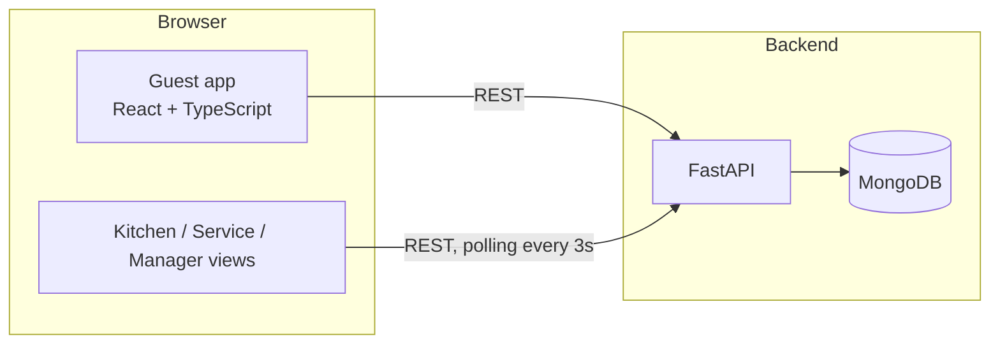

<div align="center">

# 🍽️ DineAI

**A QR-based restaurant ordering platform: guests order from their phone, the kitchen and waiters see tickets in real time, and managers run the menu and inventory.**

[](https://github.com/Shan091/dineai/actions/workflows/ci.yml)


Runs locally in a few minutes (see [Run it locally](#run-it-locally)). Open it with `?table=5` to simulate scanning a table's QR code.

<!-- Add 2-3 screenshots or a short GIF of the guest flow and the kitchen screen here:
  -->

</div>

## What it does

DineAI covers the full dining loop for a single restaurant, from the guest sitting down to the table being settled.

**Guests** (mobile web, `/`)
- Scan a table QR code (`?table=N`), sign in with a phone number and answer a short preference wizard: diet, allergens, spice level, cravings and health goals.
- Browse a **personalised menu**. Dishes get a match percentage and a reason ("Matches Spicy Craving") based on the guest's profile. Allergens, spice level, calories, prep time and ratings are shown on each dish.
- Customise portions and add-ons, get an upsell suggestion, apply offers, and pay. A **PDF receipt** is generated in the browser.
- Track the order live, and send a service request (for example a water refill) without flagging down a waiter.

**Kitchen** (`/kitchen`) sees new tickets with timers and sound alerts, and marks them ready.

**Service staff** (`/service`) see what is ready to serve and mark items served.

**Managers** (`/manager`, `/inventory`) get live analytics (revenue, average order value, active orders and best seller), plus menu management: add items, toggle availability and track stock.

## Architecture



- **Frontend:** React 19, TypeScript, Vite, React Router, Framer Motion. Shared order and session state lives in a React context that polls the API (orders every 3 seconds, the menu every 10).
- **Backend:** FastAPI with async MongoDB access (Motor) and Pydantic models.
- **Deployment:** not currently hosted. The frontend builds to static files (`npm run build`, with a `vercel.json` SPA rewrite included) and the backend is a standard ASGI app (`uvicorn main:app`), so each can go on any static host and Python host.

### Design decisions worth knowing

- **One live order per table.** If a table that already has an open order orders again, the new items are merged into the existing order and the totals are recalculated on the server (subtotal + 5% GST + 2.5% service charge). The kitchen sees the order return to "placed".
- **Item-level status.** Each item moves `pending → ready → served`, and the order's status is derived from its items (any pending item keeps the order with the kitchen, otherwise any ready item sends it to service). Kitchen and service staff can therefore work the same order independently.
- **Recommendations are rule-based, not an LLM.** The match percentage is a transparent weighted score over mood, health goals, diet and tags (see `components/SmartMenu.tsx`). That keeps it fast, free and explainable, and it is a good seam to swap for a learned ranker later.

## Tech stack

| Layer | Tools |
| --- | --- |
| Frontend | React 19, TypeScript, Vite, React Router, Framer Motion, Lucide icons, jsPDF |
| Backend | Python, FastAPI, Motor (async MongoDB), Pydantic |
| Database | MongoDB |
| Quality | pytest, Ruff, TypeScript type-checking, GitHub Actions |

## API overview

| Method | Endpoint | Purpose |
| --- | --- | --- |
| GET | `/` | Health check |
| GET / POST | `/api/menu` | List or create menu items |
| PATCH / DELETE | `/api/menu/{id}` | Edit or remove an item |
| PATCH | `/api/menu/{id}/toggle` | Toggle availability |
| POST / GET | `/api/orders` | Place an order (merges per table) or list orders (`?status=`) |
| GET | `/api/orders/{id}` | Fetch one order |
| PATCH | `/api/orders/{id}/status?status=` | Advance kitchen or service status |
| GET | `/api/tables/{id}/session` | Is there an open order at this table? |
| POST | `/api/tables/{id}/settle` | Mark a table's orders paid |
| POST | `/api/users/check`, `/api/users/login` | Look up or create a guest by phone |
| GET / PUT | `/api/users/{id}`, `/api/users/{id}/preferences` | Guest profile and preferences |

Interactive docs are served at `/docs` when the backend is running.

## Run it locally

You need Node.js 20+, Python 3.11+ and a MongoDB instance. The quickest way to get MongoDB is Docker:

```bash
docker run -d --name dineai-mongo -p 27017:27017 mongo:7
```

**Backend** (http://localhost:8000):

```bash
cd backend
python -m venv .venv && source .venv/bin/activate   # Windows: .venv\Scripts\activate
pip install -r requirements.txt
cp .env.example .env                                  # Windows: copy .env.example .env
uvicorn main:app --reload
```

An empty database is seeded with a starter menu on first start.

**Frontend** (http://localhost:3000):

```bash
npm install
cp .env.example .env.local                            # points the app at http://localhost:8000
npm run dev
```

Open <http://localhost:3000/?table=5>.

### Configuration

| Variable | Where | Purpose |
| --- | --- | --- |
| `VITE_API_URL` | frontend | Backend base URL. Defaults to `http://localhost:8000`. |
| `MONGO_URL` | backend | MongoDB connection string. Defaults to `mongodb://localhost:27017`. |
| `CORS_ORIGINS` / `FRONTEND_URL` | backend | Extra browser origins allowed to call the API (needed once the frontend is hosted). Local dev servers are always allowed. |

## Tests and checks

```bash
# Backend: 15 API tests against an in-memory MongoDB mock (no database needed)
cd backend && pip install -r requirements-dev.txt && pytest && ruff check .

# Frontend
npm run typecheck && npm run build
```

The backend tests cover the menu lifecycle, order merging and total calculation, the kitchen-to-service status flow, table sessions and settlement, guest login, and CORS. CI runs all of this on every push.

## Project structure

```
App.tsx, index.tsx        app shell and routes
components/               guest UI, kitchen and service dashboards, modals
pages/                    manager and inventory dashboards
context/                  shared order/session state and polling
services/                 API client and types
utils/                    PDF receipts, notification sounds
backend/
  main.py                 FastAPI routes
  models.py, schemas.py   Pydantic models
  database.py             MongoDB connection
  tests/                  API tests
```

## Known limitations and roadmap

This started as an MVP, and the gaps below are the next things to fix.

- [ ] **Authentication and authorisation.** Staff pages (`/kitchen`, `/service`, `/manager`, `/inventory`) and the write endpoints are open, and guest sign-in uses a phone number without OTP verification. Add staff login with roles, OTP for guests, and protect mutating endpoints.
- [ ] **Server-side pricing.** The first order at a table accepts the client's `totalAmount`; only merged orders are recomputed on the server. Price items and apply offers on the server, using menu prices rather than client-sent ones.
- [ ] **Input validation.** `PATCH /api/menu/{id}` accepts an arbitrary dictionary. Replace it with a typed update model.
- [ ] **Real-time updates.** Replace polling with WebSockets or server-sent events.
- [ ] **Payments.** The payment screen is a simulation; integrate a payment provider.
- [ ] **Tooling.** Replace the Tailwind CDN script with build-time Tailwind, migrate FastAPI `on_event` startup to lifespan handlers, and add frontend tests.

## License

[MIT](LICENSE)
